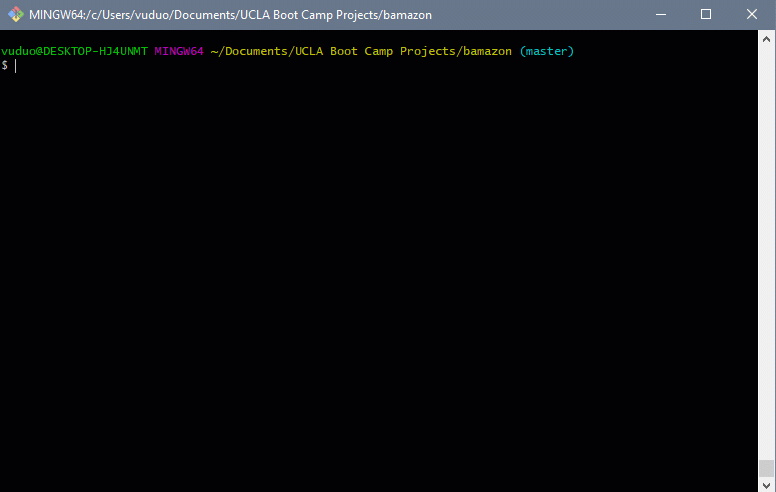

# Node.js & MySQL

## Overview
The assignment is to create an Amazon-like storefront with MySQL Database. The app will take in orders from customers and deplete stock from the store's inventory. It also tracks product sales across store's departments and provides a summary of the highest-grossing departments in the store.

### Database Schema

Please check schema.sql file for the demo database.

### Customer View - bamazonCustomer.js
Running this application will first display all of the items available for sale. Include the ids, names, and prices of products for sale. The app then prompts users to go through the buying process and updates sales and stock quantity. It also considers two scenerios:
- Product ID not available
- Ordered quantity is higher than available stock

In the demo below, we try buying 100 pajamas (product ID: 2) and see how it updates stock quantity, product_sales and show customers' total orders.

### Manager View  - bamazonManager.js

Running this application will list a set of menu options:

1. View Products for Sale
2. View Low Inventory
3. Add to Inventory
4. Add New Product

* If a manager selects `View Products for Sale`, the app should list every available item: the item IDs, names, prices, and quantities.
* If a manager selects `View Low Inventory`, then it should list all items with an inventory count lower than five.
* If a manager selects `Add to Inventory`, your app should display a prompt that will let the manager "add more" of any item currently in the store.
* If a manager selects `Add New Product`, it should allow the manager to add a completely new product to the store.

In this demo below, we try adding 5 LG TV to the current stock and a new product - Macbook Air.

### Supervisor View - bamazonSupervisor.js

Running this application will list a set of menu options:

1. View Product Sales by Department
2. Create New Department

When a supervisor selects `View Product Sales by Department`, the app should display a summarized table in their terminal/bash window.

